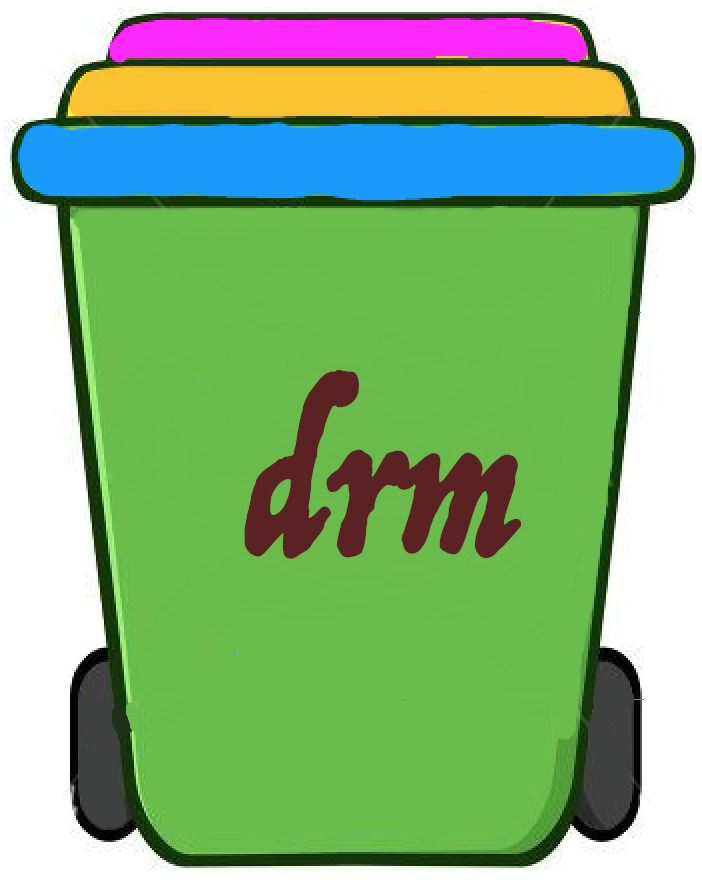

<p align="center">

<br>
<a href="https://travis-ci.org/lylex/drm"></a>
<a href="https://goreportcard.com/report/github.com/lylex/drm"></a>
<a href="https://godoc.org/github.com/lylex/drm"></a>
<a href="https://github.com/lylex/drm/blob/master/LICENSE"></a>
<a href="https://github.com/lylex/drm"></a>
</p>

Drm, pronounced like "dream". It is a tiny tool to avoid tragedies caused by `rm`. Actually, I did decide to write it after I `rm`ed a whole day's hard-work. It can replace `rm` in basic function, and support resume deleted files before it reaches the expiration days(e.g. 30 days).

Features
========

- `rm` a file or directory
- View deleted files or directories
- Resume deleted objects
- Auto-purge delete object after configed TTL days


Getting Started
===============

## Installing

### MacOS

Download released packages from [release page](https://github.com/lylex/drm/releases), e.g. drm_v0.1.0_Darwin_x86_64.tar.gz

Run the following commands:

```shell
tar -xzf drm_v0.1.0.tar.gz
cd drm
sudo ./scripts/mac/install_mac.sh
```

### Linux

Download binary from [release page](https://github.com/lylex/drm/releases), e.g. drm_v0.1.0_Linux_x86_64.deb

run the following commands:

```shell
sudo dpkg -i drm_v0.1.0_Linux_x86_64.deb
```

## Use

After installation, binary is copied to executable path, and alias to replace `rm` is added to /etc/profile. Now you can use `drm` just like `rm` which you are familiar with.

```
$ rm --help

This application is used to rm files with a latency.

Usage:
  drm [flags]
  drm [command]

Available Commands:
  help        Help about any command
  list        list all the deleted objects
  restore     restore one or more the deleted objects

Flags:
      --config string   config file (default is /etc/drm/drm.conf) (default "/etc/drm/drm.conf")
  -f, --force           ignore nonexistent files and arguments, never prompt
  -h, --help            help for drm
  -r, --recursive       remove directories and their contents recursively or not
      --version         version for drm

Use "drm [command] --help" for more information about a command.
```

### Delete a directory

Just run `rm -rf ./dir` or `drm -rf ./dir`, since they are alias now.

### List deleted files

```
drm list
```

or 

```
rm list
```

And you will see something like:

```
Name       Path                                 DeleteAt             ID
----       ----                                 --------             --
LICENSE    /Users/lylex/workspace/drm/dist/temp  2018-12-22 22:38:13  Rvv3Jg
README.md  /Users/lylex/workspace/drm/dist/temp  2018-12-22 22:38:34  SHgtPG
```

### Resume a file a directory

Run

```
drm restore testfile
```

Or

```
rm restore testfile
```

Then the file "testfile" will be resumed.


✋ Contributing
========

I will be so happay if this tiny tool can help you in any way. And I am really glad if you can help make it better. So please feel free to contribute by

- Opening an [issue](https://github.com/lylex/drm/issues/new)
- Sending me feedback via [email](mailto://xuqianzhou@gmail.com)

License
========

Drm source code is available under the MIT [License](/LICENSE).
